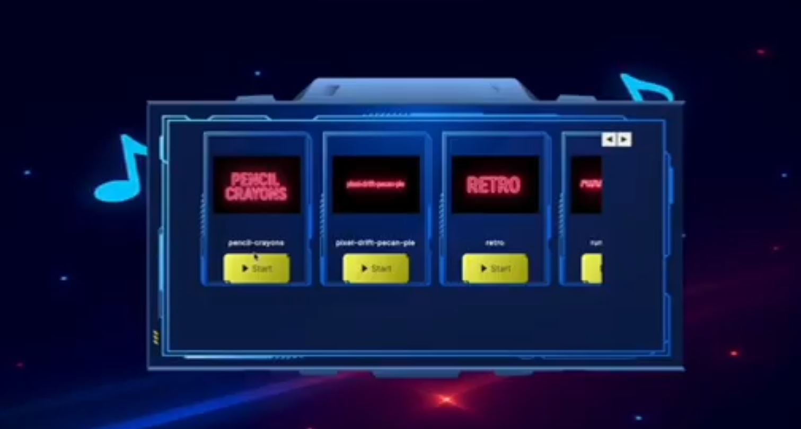

# 🚀    Bead Run 
## 📖 Audio Visualization 

🎶 Gameplay Concept  

The runner transforms your music into the game itself — every beat shapes the experience:  

- 🎵 Each beat shifts the track and changes the stage  
- 🌈 Colors react dynamically to the rhythm  
- ⚡ The challenge speeds up with the intensity of the music  

In short: **the entire gameplay is generated from your music clip — the beat controls the stage.**

## 

## 📖 Photos Album 

  
   
   
   

